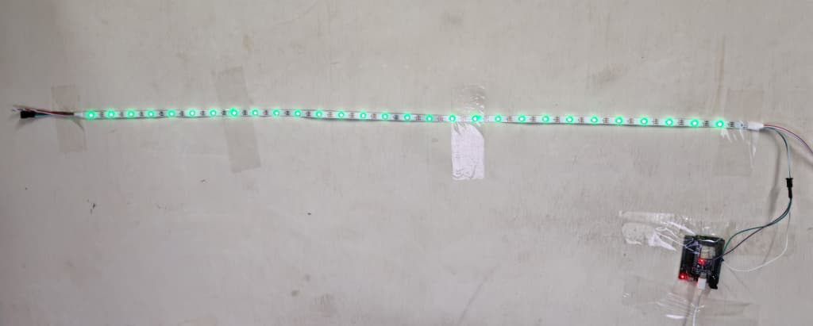
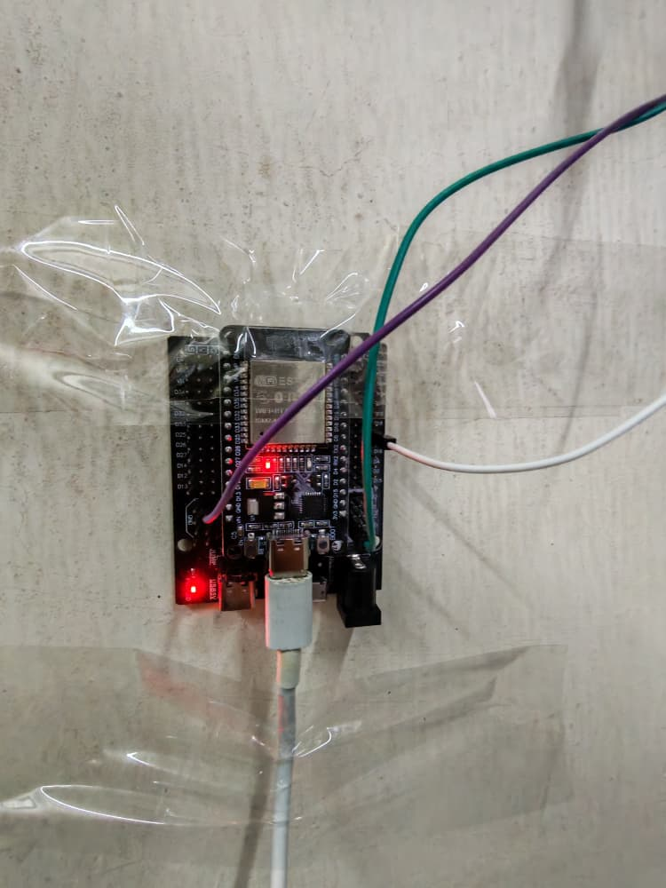
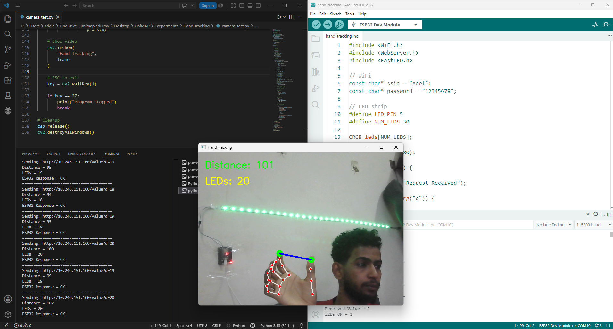
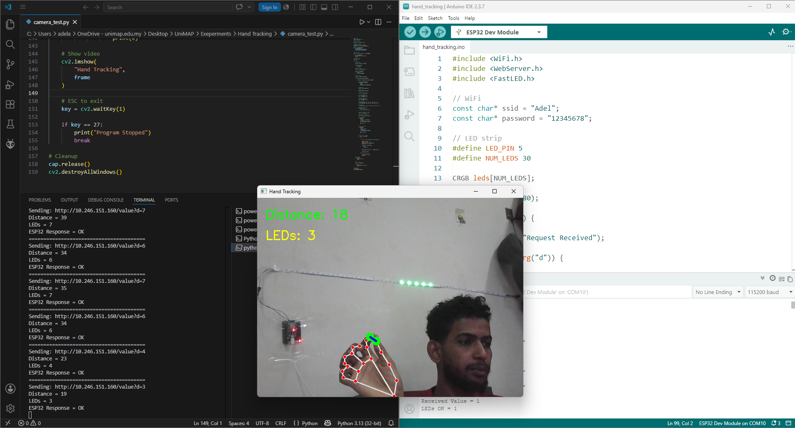
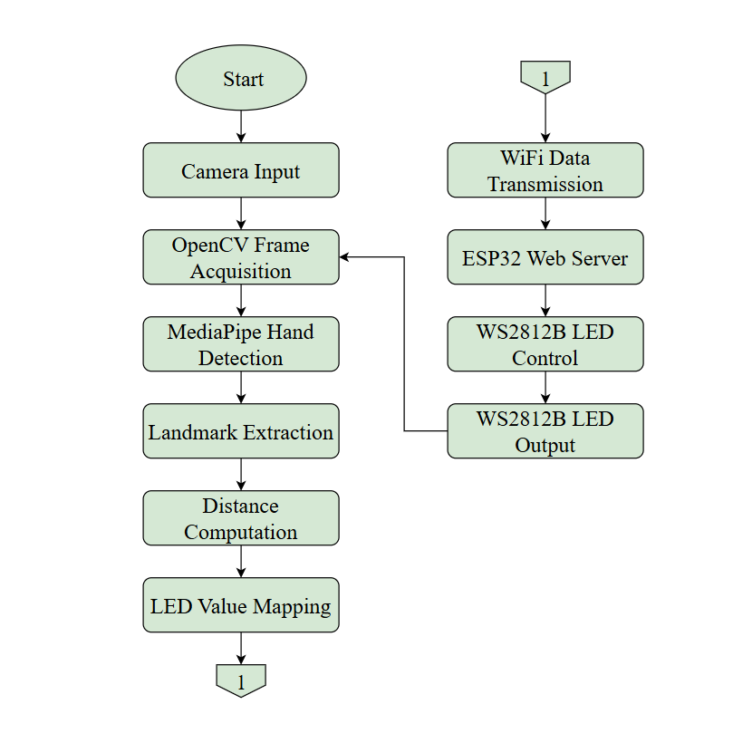

# Hand-Tracking LED Control System Using ESP32 and WS2812B LED Strip


Control a WS2812B LED strip using real-time hand gestures detected by MediaPipe and OpenCV. The system measures the distance between the thumb and index finger, sends the calculated value wirelessly to an ESP32 over WiFi, and dynamically controls LED illumination from the center of the LED strip outward.

---

# Project Overview

This project demonstrates the integration of Computer Vision, Embedded Systems, Wireless Communication, and Human-Computer Interaction.

A laptop camera continuously captures video frames and processes them using OpenCV and MediaPipe Hand Tracking. The system detects hand landmarks and calculates the distance between the thumb tip and index finger tip.

The calculated distance is converted into an LED control value and transmitted wirelessly through WiFi to an ESP32 microcontroller acting as a web server.

The ESP32 receives the value and controls a WS2812B LED strip using the FastLED library. LEDs illuminate symmetrically from the center of the strip outward, creating a real-time visual response based on finger movement.

This project demonstrates how computer vision can be used to interact with physical hardware in real time.

---

# Main Features

- Real-time hand tracking using MediaPipe
- Finger distance measurement
- Wireless communication using WiFi
- ESP32 web server implementation
- WS2812B LED strip control
- Center-outward LED lighting effect
- Real-time visual feedback
- OpenCV image processing
- Human gesture-based interaction
- Embedded system integration

---

# Hardware Components

| Component | Description |
|------------|-------------|
| ESP32 Development Board | Main microcontroller |
| WS2812B LED Strip | Addressable RGB LED strip |
| Laptop Camera | Video input device |
| USB Cable | ESP32 programming and power |
| Jumper Wires | Hardware connections |
| Computer | Runs Python hand tracking application |

---

# Software Components

| Software | Purpose |
|-----------|---------|
| Python | Main application |
| OpenCV | Video processing |
| MediaPipe | Hand tracking |
| Requests | HTTP communication |
| Arduino IDE | ESP32 programming |
| FastLED Library | LED strip control |
| WiFi Library | ESP32 networking |
| WebServer Library | HTTP server |

---

# System Operation

The laptop camera continuously captures video frames.

MediaPipe detects the hand and extracts landmark positions.

The thumb tip and index finger tip coordinates are obtained.

The Euclidean distance between the two fingers is calculated.

The distance value is converted into the number of LEDs that should be illuminated.

The Python application sends the LED value to the ESP32 using an HTTP GET request through WiFi.

The ESP32 receives the LED value through its web server.

The received value is processed and used to control the WS2812B LED strip.

LEDs illuminate symmetrically from the center of the strip outward according to the detected hand gesture.

The process repeats continuously in real time.

---

# Hardware Implementation

## WS2812B LED Strip Output



The figure above shows the WS2812B LED strip connected to the ESP32 development board. The LEDs illuminate dynamically according to the detected finger distance. The lighting effect expands from the center of the strip toward both ends.

---

## ESP32 Connection Setup



The figure above shows the ESP32 hardware setup used in this project. The ESP32 acts as a wireless web server that receives LED values from the Python application and controls the WS2812B LED strip through the FastLED library.

---

## Hand Tracking Demonstration



The figure above demonstrates real-time hand tracking using MediaPipe. The thumb tip and index finger tip are detected, and the distance between them is continuously measured and displayed.

---

## Complete System Overview



The figure above shows the complete working system including the laptop camera, Python application, WiFi communication, ESP32 microcontroller, and WS2812B LED strip.

---

# Demonstration Video

The complete project demonstration video can be viewed using the link below:

https://drive.google.com/file/d/1or3f6PP1oKcbgLsSKNECQYXhgprb0exj/view?usp=drive_link

The video demonstrates:

- Real-time hand detection
- Finger distance measurement
- WiFi communication
- ESP32 data reception
- Dynamic LED strip control
- Center-outward LED illumination

---

# System Flowchart



The flowchart above illustrates the complete workflow of the proposed system. The process starts with capturing video frames from the laptop camera using OpenCV. MediaPipe then detects the hand and extracts the required landmarks. The distance between the thumb tip and index finger tip is calculated and mapped to an LED control value. This value is transmitted wirelessly through WiFi to the ESP32 web server. The ESP32 processes the received data and controls the WS2812B LED strip accordingly. The process repeats continuously to provide real-time interaction between hand gestures and LED output.

---

# Source Code

The project consists of two main programs that work together to perform real-time hand gesture-based LED control.

---

## ESP32 Firmware

The ESP32 firmware is responsible for:

- Connecting to the WiFi network
- Creating an HTTP web server
- Receiving LED values from the Python application
- Processing incoming data
- Controlling the WS2812B LED strip
- Illuminating LEDs symmetrically from the center outward

The complete ESP32 source code is shown below:

```cpp
#include <WiFi.h>
#include <WebServer.h>
#include <FastLED.h>

// WiFi
const char* ssid = "Adel";
const char* password = "12345678";

// LED strip
#define LED_PIN 5
#define NUM_LEDS 30

CRGB leds[NUM_LEDS];

WebServer server(80);

void handleValue() {

  Serial.println("Request Received");

  if (server.hasArg("d")) {

    int ledsOn = server.arg("d").toInt();

    Serial.print("Received Value = ");
    Serial.println(ledsOn);

    ledsOn = constrain(ledsOn, 0, 15);

    // Turn OFF all LEDs
    for (int i = 0; i < NUM_LEDS; i++) {
      leds[i] = CRGB::Black;
    }

    // Center position
    int center = NUM_LEDS / 2;

    // Light from center outward
    for (int i = 0; i < ledsOn; i++) {

      int left = center - i;
      int right = center + i;

      if (left >= 0)
        leds[left] = CRGB::Green;

      if (right < NUM_LEDS)
        leds[right] = CRGB::Green;
    }

    FastLED.show();

    Serial.print("LEDs ON = ");
    Serial.println(ledsOn);
  }

  server.send(200, "text/plain", "OK");
}

void setup() {

  Serial.begin(115200);

  Serial.println();
  Serial.println("ESP32 Starting...");

  FastLED.addLeds<WS2812B, LED_PIN, GRB>(leds, NUM_LEDS);

  FastLED.clear();
  FastLED.show();

  Serial.println("Connecting to WiFi...");

  WiFi.begin(ssid, password);

  while (WiFi.status() != WL_CONNECTED) {
    delay(500);
    Serial.print(".");
  }

  Serial.println();
  Serial.println("================================");
  Serial.println("WiFi Connected!");
  Serial.print("SSID: ");
  Serial.println(ssid);
  Serial.print("IP Address: ");
  Serial.println(WiFi.localIP());
  Serial.println("================================");

  server.on("/value", handleValue);

  server.begin();

  Serial.println("HTTP Server Started");
}

void loop() {
  server.handleClient();
}
```

---

## Python Application

The Python application is responsible for:

- Capturing video from the laptop camera
- Detecting the hand using MediaPipe
- Extracting hand landmarks
- Measuring the distance between the thumb and index finger
- Converting the distance into LED values
- Sending LED values to the ESP32 through WiFi
- Displaying real-time feedback

The complete Python source code is shown below:

```python
import cv2
import mediapipe as mp
import requests

# ESP32 IP Address
ESP32_IP = "10.246.151.160"

# MediaPipe setup
mp_hands = mp.solutions.hands
mp_draw = mp.solutions.drawing_utils

hands = mp_hands.Hands(
    max_num_hands=1,
    min_detection_confidence=0.7,
    min_tracking_confidence=0.7
)

# Open camera
cap = cv2.VideoCapture(0, cv2.CAP_DSHOW)

if not cap.isOpened():
    print("Cannot open camera")
    exit()

# Previous value
last_leds = -1

while True:

    # Read frame
    success, frame = cap.read()

    # Skip bad frames
    if not success:
        continue

    # Mirror image
    frame = cv2.flip(frame, 1)

    # Convert BGR to RGB
    rgb = cv2.cvtColor(
        frame,
        cv2.COLOR_BGR2RGB
    )

    # Detect hand
    results = hands.process(rgb)

    if results.multi_hand_landmarks:

        for hand in results.multi_hand_landmarks:

            # Draw hand landmarks
            mp_draw.draw_landmarks(
                frame,
                hand,
                mp_hands.HAND_CONNECTIONS
            )

            # Thumb tip
            thumb = hand.landmark[4]

            # Index tip
            index = hand.landmark[8]

            # Frame size
            h, w, c = frame.shape

            # Thumb coordinates
            x1 = int(thumb.x * w)
            y1 = int(thumb.y * h)

            # Index coordinates
            x2 = int(index.x * w)
            y2 = int(index.y * h)

            # Draw circles
            cv2.circle(frame, (x1, y1), 10, (0, 255, 0), -1)
            cv2.circle(frame, (x2, y2), 10, (0, 255, 0), -1)

            # Draw line
            cv2.line(frame, (x1, y1), (x2, y2), (255, 0, 0), 3)

            # Calculate distance
            distance = int(
                ((x2 - x1) ** 2 +
                 (y2 - y1) ** 2) ** 0.5
            )

            # Convert distance to LEDs
            leds = int(distance / 5)

            # Limit to 0 - 30 LEDs
            leds = max(0, min(30, leds))

            # Show distance
            cv2.putText(
                frame,
                f"Distance: {distance}",
                (20, 50),
                cv2.FONT_HERSHEY_SIMPLEX,
                1,
                (0, 255, 0),
                2
            )

            # Show LEDs value
            cv2.putText(
                frame,
                f"LEDs: {leds}",
                (20, 100),
                cv2.FONT_HERSHEY_SIMPLEX,
                1,
                (0, 255, 255),
                2
            )

            # Send only if changed
            if leds != last_leds:

                try:

                    url = f"http://{ESP32_IP}/value?d={leds}"

                    print("=" * 40)
                    print("Sending:", url)
                    print("Distance =", distance)
                    print("LEDs =", leds)

                    response = requests.get(
                        url,
                        timeout=1
                    )

                    print("ESP32 Response =", response.text)

                    last_leds = leds

                except Exception as e:

                    print("ESP32 ERROR:")
                    print(e)

    # Show video
    cv2.imshow(
        "Hand Tracking",
        frame
    )

    # ESC to exit
    key = cv2.waitKey(1)

    if key == 27:
        print("Program Stopped")
        break

# Cleanup
cap.release()
cv2.destroyAllWindows()
```

---

# Installation

## Python Libraries

```bash
pip install opencv-python mediapipe requests
```

## Arduino Libraries

Install the following libraries using Arduino IDE Library Manager:

- FastLED
- WiFi
- WebServer

---

# How to Run

### Step 1

Open the Arduino IDE and upload the ESP32 firmware:

```text
hand_tracking.ino
```

### Step 2

Connect the ESP32 and computer to the same WiFi network.

### Step 3

Open the Serial Monitor and note the ESP32 IP address displayed after a successful WiFi connection.

### Step 4

Open the Python source code:

```text
camera_test.py
```

Update the ESP32 IP address:

```python
ESP32_IP = "YOUR_ESP32_IP"
```

### Step 5

Run the Python application:

```bash
python camera_test.py
```

### Step 6

Place your hand in front of the laptop camera.

### Step 7

Move the thumb and index finger closer together or farther apart.

### Step 8

Observe the WS2812B LED strip responding in real time according to the detected finger distance.

---

# Project Objectives

- Apply computer vision techniques
- Implement real-time hand tracking
- Integrate Python with embedded hardware
- Develop wireless communication systems
- Control LEDs using human gestures
- Demonstrate Human-Computer Interaction (HCI)
- Explore IoT and embedded system applications

---

# Results

The system successfully detects hand gestures in real time and converts finger distance into LED control commands.

The ESP32 reliably receives the transmitted data through WiFi and updates the LED strip without noticeable delay.

The center-outward lighting effect provides intuitive visual feedback and demonstrates successful integration between computer vision and embedded systems.

The project achieved stable operation and real-time responsiveness during testing.

---

# Future Improvements

- RGB color control using hand gestures
- LED brightness adjustment
- Multiple hand tracking support
- Mobile application integration
- MQTT communication protocol
- Cloud-based monitoring
- Advanced gesture recognition
- IoT dashboard implementation
- Remote wireless control

---

# Conclusion

This project successfully demonstrates a real-time hand gesture control system using MediaPipe, OpenCV, Python, ESP32, and a WS2812B LED strip.

The system combines computer vision, wireless communication, and embedded control into a single interactive platform capable of translating human hand movements into physical hardware responses.

The project highlights the practical application of gesture-based interfaces and provides a strong foundation for future smart control and IoT systems.

---

# Author

**Adel Husham Mohamedain**
